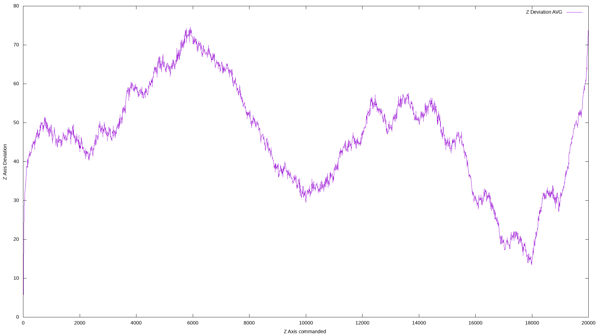

# soundindicator
Interface to a cheap digital dial indicator and a 3d printer

---

***NOTE:***
This project is not intended to be maintained for public use, it may serve as an inspiration for others though. 
Pull requests are welcome, feature requests and bug reports will only be worked on when they annoy me enough.

---

Inspirations were drawn from https://github.com/MGX3D/EspDRO (links to a connector for chinese dial indicators and calipers) and https://hackaday.io/project/511-digital-dial-indicator-cnc-surface-probe/log/814-the-digital-dial-indicator-and-how-to-read-from-it

With it (and gnuplot) you can easily create a graph like this, which shows the error of an ender 3 pro Z axis movement:




```
Valid options:
  -h [ --help ]                         produce this help message
  -V [ --version ]                      Show the program version
  -v [ --verbose ] arg                  Increase the initial logging level (may
                                        be overridden by a config file)
  -b [ --banner ] [=arg(=1)]            Indicator output in banner mode
  -m [ --mode ] arg                     Operating mode: plot or volume
  -a [ --average ] arg (=1)             Average over that many runs in plot 
                                        mode
  -A [ --axis ] arg                     The axis to use in plot mode
  -s [ --start ] arg (=0)               Start movement at this point (mm)
  -e [ --end ] arg (=2)                 End movement at this point (mm)
  -S [ --steps ] arg (=0.00999999978)   The steps to be done per measurement 
                                        (mm), the absolute value will be used 
                                        in the proper direction
  -B [ --bidirectional ] [=arg(=1)] (=0)
                                        Do the movement in both directions
  -p [ --preposition ] arg              Before driving to the start, drive to 
                                        this position (simulates auto homing 
                                        and hop movements)
  -F [ --speed ] arg (=10)              The speed to move with, given to the F 
                                        parameter of G1
  -r [ --stable ] arg (=0)              For each reading wait to stabilize for 
                                        that many readings first. Makes 
                                        measurements slower, can prevent them 
                                        totally if you have a too high value
  -d [ --device ] arg (=/dev/ttyACM0)   The serial port device the printer is 
                                        attached to
  -g [ --gcode ] arg                    Some gcode to execute before everyhting
                                        else
  -d [ --swap_cd ] arg (=0)             Swap data/clock signal on the sound 
                                        card

```

### Compiling
You need a recent boost and proper portaudio installation, check error messages for yourself ;)

### Calibrating Volume

You need to run it in mode volume to calibrate. Start with volume of maybe 5% and increase until it shows GOOD most of
the time. If it doesn't your voltage levels may be of and some more code is needed to properly do things. You might want
to try reading out anyways, who knows, it might work.
